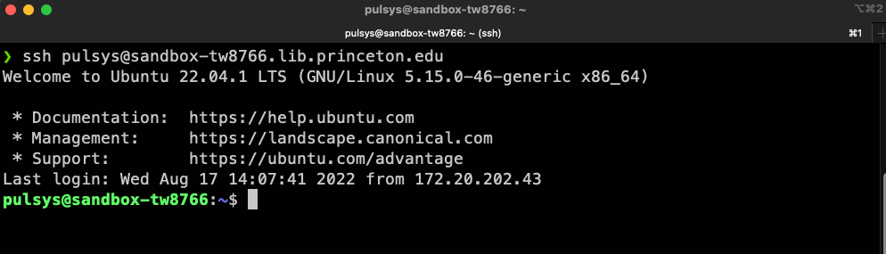

## Shells and Terminals

Shell is a term for graphical or text-based interfaces that we use to interact with operating systems. They are programs that provide a form of input and output to control computers. We often use a graphical user interface and thus a graphical shell. When we open a command-line window, also called terminal, a text-based shell is started for us in that window. Using this shell, we can control the computer by issuing text commands. Modern terminals work as terminal emulators, emulating text-based environments in a graphical interface.

There are several text-based shells that we can use, but the most common and useful to know is *Bourne Again SHell*, known as [Bash](https://www.gnu.org/software/bash/). It is the shell commonly associated with all the Virtual Machines developers will use at PUL. Another popular shell is [Z shell](https://zsh.sourceforge.io/) (Zsh), now the default shell on macOS. [fish shell](https://fishshell.com/) is also gaining popularity, being designed to be a user-friendly shell with good defaults. However, it is less compatible with the other mentioned shells. Windows operating system also has its shell called *PowerShell*.

Besides terminals, we can take advantage of terminal multiplexers. We use [tmux](https://github.com/tmux/tmux/wiki) to open multiple shells in one window or screen. Terminal multiplexers can also detach and reattach a shell session which can be helpful in controlling remote processes.

log in to your virtual machine with `ssh pulsys@sandbox-<yournetid>.lib.princeton.edu`

## Prompt



Opening a terminal will start a new shell session. We are then given access to a command line to execute commands. The beginning of the command line before the cursor is known as the command prompt (the [`pulsys@sandbox-tw8766 ~`]\$ in the picture).
Typically, the following is displayed:
  * The user name of the user running the shell. The user affects all executed commands, as they will be run within this user’s permissions.
  * The name or an IP address of the computer where commands will be executed
  * The currently selected directory (the ~ in the picture after the computer name). The currently selected directory (the ~ in the picture after the computer name). A tilde refers to the user’s home directory.
  * The account type. By convention, the dollar sign ($) denotes a regular user whereas the hash (#) is used for system administrators. In documentation and various tutorials, these symbols might be used to distinguish whether something should be run under administrator privileges.
    * run the following command on the VM `sudo bash` which will elevate your privileges to become a super user and watch the dollar ($) change to a (#)

## Running Commands

Running commands is as simple as typing them and hitting **Enter**. However, it is
important to know where a command is executed in the file system. Typically, a new
shell session will start at our home directory like `/home/pulsys`  who is the name of our user on our VMs. (it can sometimes be `deploy` or `conan`). We can see where we are by running the command `pwd` (print working directory):

```bash
pulsys@sandbox-tw8766:~$ pwd
/home/pulsys
```

A command like this seems straightforward, but it is not. The problem is that `pwd` can run a script, an executable binary, a custom shell function, an alias, or a shell built-in (built-ins are utilities implemented directly in the shell itself). We will see all of those things in action later. 

The easiest way to do that is with the command `type -a pwd`. It will print all executable things named pwd.

```bash
pulsys@sandbox-tw8766:~$ type -a pwd
pwd is a shell builtin
pwd is /usr/bin/pwd
pwd is /bin/pwd
```

`pwd` is a shell built-in. Because it is a shell built-in, it will take precedence over external programs. Notice in the the output above it is mentioned first.

Shells will search for executable programs in a list of locations called the PATH. On Linux, the PATH looks something like this:

```bash
/home/pulsys/.local/bin:/usr/share/Modules/bin:/usr/local/bin:/usr/local/sb
in:/usr/bin:/usr/sbin:/home/username/bin:/var/lib/snapd/snap/bin
```

We can see that the PATH is just a list of file system paths separated by semicolons. Any program in one of these locations can be executed without specifying its location.

Because `/usr/bin` is mentioned here, the shell can find `/usr/bin/pwd` just based on the file name. If multiple programs have the same name, the order of the paths will be taken into account.

What can we do if a program is not on the PATH, or when we need to run a program
overshadowed by another program or built-in of the same name? We need to run it by typing the absolute or relative file path.

The PATH is stored as a process environment variable, exposed in a shell as a shell
variable

## Online help

All the documentation about the Unix system is available using the online help facility. Every topic has a manual page describing it; commands have a manual page on how to use the.

Each manual page is indexed by the name of the command or system call and a one-line description of what it does. Suppose you needed to find the spelling of word in a documents you have. You can search your system for the keyword using the following format. `man -k <keyword>`

To search all topics related to editor checking we'd use:

```bash
pulsys@sandbox-tw8766:~$ man -k editor
ed (1)               - line-oriented text editor
editor (1)           - Nano's ANOther editor, an enhanced free Pico clone
ex (1)               - Vi IMproved, a programmer's text editor
nano (1)             - Nano's ANOther editor, inspired by Pico
pico (1)             - Nano's ANOther editor, an enhanced free Pico clone
red (1)              - line-oriented text editor
rview (1)            - Vi IMproved, a programmer's text editor
rvim (1)             - Vi IMproved, a programmer's text editor
sed (1)              - stream editor for filtering and transforming text
select-editor (1)    - select your default sensible-editor from all installed editors
sensible-editor (1)  - sensible editing
tc-pedit (8)         - generic packet editor action
tc-skbmod (8)        - user-friendly packet editor action
vi (1)               - Vi IMproved, a programmer's text editor
view (1)             - Vi IMproved, a programmer's text editor
vim (1)              - Vi IMproved, a programmer's text editor
```

To display the actual page manual for pico type:

```bash
man 1 pico
```

```bash
NANO(1)                         General Commands Manual                        NANO(1)

NAME
       nano - Nano's ANOther editor, inspired by Pico

SYNOPSIS
       nano [options] [[+line[,column]] file]...

       nano [options] [[+[crCR](/|?)string] file]...

DESCRIPTION
       nano  is a small and friendly editor.  It copies the look and feel of Pico, but
       is free software, and implements several features that  Pico  lacks,  such  as:
       opening  multiple  files,  scrolling per line, undo/redo, syntax coloring, line
       numbering, and soft-wrapping overlong lines.

       When giving a filename on the command line, the cursor can be put on a specific
       line  by  adding  the line number with a plus sign (+) before the filename, and
       even in a specific column by adding it with a comma.  (Negative  numbers  count
       from  the end of the file or line.)  The cursor can be put on the first or last
       occurrence of a specific string by specifying that string after +/ or +? before
       the filename.  The string can be made case sensitive and/or caused to be inter‐
       preted as a regular expression by inserting c and/or r after the + sign.  These
       search modes can be explicitly disabled by using the uppercase variant of those
       letters: C and/or R.  When the string contains spaces, it needs to be  enclosed
       in  quotes.   To give an example: to open a file at the first occurrence of the
```


Several things to note:

There are several different sections of the online manual. This man document is located in section 1 of the manual as highlighted in the top left. There is another manual page titled man in section 7.
Anything in the [] brackets is optional.
The man command has several options associated with it. In Unix,  options are specified with a - (for short format) and -- (for long format) followed by the option. (-f, -k, -m)

As demonstrated earlier you can look for information about a command without knowing anything about the name of the command. man -k spell printed a list of all manual pages that have spell in the name or description.

In addition to this most commands will use the -h or --help flag. Let's try it with our result from before

To exit your VM type `exit` 